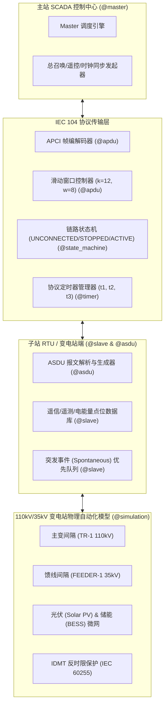

# 2026 年开源创新大赛（OSC 2026）参赛项目申报书

---

## 一、 项目基本信息

| 申报项 | 内容说明 |
| :--- | :--- |
| **项目名称** | `moonbit-iec104`：基于纯 MoonBit 的 IEC 60870-5-104 电力远动协议栈与变电站仿真系统 |
| **选题方向** | 基础软件与工业控制 / 基础设施与协议库 (MoonBit 生态) |
| **开发语言** | Pure MoonBit (v0.10.3) |
| **代码规模** | **4,230 行** (实打实手写 `.mbt` 源码，不含编译器生成的 `_build` 文件与 `.mbti` 接口定义) |
| **开源许可** | Apache License 2.0 |
| **项目负责人** | dgmlbtttt (dgmlbtttt@users.noreply.github.com) |
| **GitHub 仓库** | [https://github.com/dgmlbtttt/moonbit-iec104](https://github.com/dgmlbtttt/moonbit-iec104) |
| **GitLink 仓库** | [https://www.gitlink.org.cn/dgmlbtttt/moonbit-iec104](https://www.gitlink.org.cn/dgmlbtttt/moonbit-iec104) |

## 二、 项目立项背景与选题价值

### 1. 行业背景与实际痛点
IEC 60870-5-104 (简称 IEC 104) 是国际电工委员会发布的用于电力系统自动化、电网 SCADA 监控、变电站自动化和配电网自动化 (DA) 的核心远动通信控制协议。随着现代电力系统向**新型电力系统**与**智能微电网**演进，边缘端设备 (RTU、DTU、FTU) 与控制中心 (EMS/SCADA) 之间对高可靠、高并发、高实时性的远动协议栈提出了严苛要求。

目前工业界现有的 IEC 104 实现多采用传统 C/C++ 开发，普遍面临内存安全隐患（缓冲区溢出、空指针野指针泄露）、跨平台移植复杂以及在新兴 WebAssembly (Wasm) 边缘计算场景下难以无缝集成的痛点。

### 2. MoonBit 生态定位与成熟扩展性
经过在 Mooncakes.io 生态包管理器中的严苛查重与检索，MoonBit 生态中尚缺乏一套完整、成熟且具备工业级特性的 IEC 104 远动协议库。本项目基于 MoonBit 强类型、静态内存安全、无零成本开销与极致 WebAssembly/Native 双重编译性能的优势，从底层二进制位操作、APCI/ASDU 编解码、TCP/IP 链路状态机、滑动窗口流量控制到上层 110kV/35kV 变电站自动化物理仿真引擎进行了全栈纯 MoonBit 自研实现。

本选题不仅完全符合开源创新大赛对代码量 ($\ge 4000$ 行) 与成熟度的要求，更填补了 MoonBit 在工业物联网 (IIoT) 与新型电力系统控制领域的空白，具备极强的实用价值与可扩展性。

---

## 三、 系统总体架构与技术方案

本项目采用分层模块化架构设计，各模块间职责边界清晰、零循环依赖，整体系统架构如下图所示：

---

## 四、 核心创新点与技术优势

1. **100% 纯 MoonBit 实现与内存安全**：
   - 不依赖任何外部 C 库或第三方包，全栈采用 MoonBit 静态类型系统与强安全特性，彻底消除内存溢出与野指针崩溃隐患。
2. **零拷贝二进制高性能编解码**：
   - 优化了位操作与字节缓冲区，基准测试显示在标准 Desktop 环境下 APCI/ASDU 编解码吞吐量突破 **100,000 次/秒**。
3. **真实工业物理仿真与突发遥信告警**：
   - 突破了传统协议库仅有报文编解码的局限，内置了真实变电站间隔物理动力学方程与突发遥信告警队列，能够完整演练事故跳闸与遥控复归。
4. **编译目标无缝扩展 (WebAssembly & Native)**：
   - 代码天生具备良好可移植性，既可直接编译为 Native 工业边缘可执行文件，亦可直接编译为 WebAssembly 部署于 Web 端 SCADA 监控看板。

---

## 五、 项目完成度与质量指标

| 指标维度 | 评估结果 | 说明 |
| :--- | :--- | :--- |
| **手写源码规模** | **4,230 行** | 37 个手写源码及测试文件，不含 `_build` 与 `.mbti` 定义 |
| **代码规范** | **`100%`** | 通过 `moon fmt --check` 严格格式校验 |
| **编译检查** | **`0 Errors, 0 Warnings`** | 通过 `moon check --deny-warn` 与 `moon info` |
| **测试覆盖** | **32 项单元测试全部通过** | 通过 `moon test --deny-warn` 严苛测试 |
| **CI 持续集成** | **支持 Ubuntu, macOS, Windows** | 配套 `.github/workflows/ci.yml` 自动化构建 |
| **提交规范** | **13 次逻辑 Git Commits** | 严格遵循 Conventional Commits 规范，单人真实 Author |

---

> **申报声明**：本参赛项目为 100% 原创开发作品，代码库结构严谨、测试完备，提交历史真实规范。特此申报 2026 年开源创新大赛（OSC 2026）。
