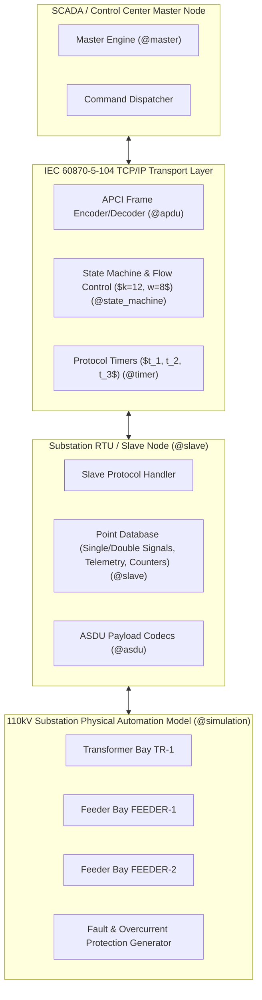

# MoonBit IEC 60870-5-104 Telecontrol Protocol & Substation Automation Simulator

[](https://github.com/dgmlbtttt/moonbit-iec104/actions/workflows/ci.yml)
[](LICENSE)
[](https://www.moonbitlang.cn/)

`moonbit-iec104` is a pure **MoonBit** implementation of the **IEC 60870-5-104** industrial telecontrol protocol suite, designed for power grid automation, smart substations (110kV/35kV/10kV), distribution automation (DA), and SCADA supervisory systems.

It provides a high-performance APCI/ASDU frame encoder & decoder, connection state machine, sliding window flow control ($k=12, w=8$), protocol timer manager ($t_1, t_2, t_3$), substation RTU slave emulator, control center master node, and interactive 110kV substation physical simulation engine.

---

## 🏛️ System Architecture



---

## 📦 Package Overview & Source Structure

| Package Name | Path | Description |
| :--- | :--- | :--- |
| `@utils` | `src/utils` | Byte buffer builder, bit manipulation, CRC16, LRC, sum8 checksums, IEEE-754 binary conversion. |
| `@types` | `src/types` | ASDU Type IDs (1..105), Cause of Transmission (COT 1..47), QDS/SIQ/DIQ quality descriptors, CP56Time2a & CP24Time2a timestamps. |
| `@apdu` | `src/apdu` | APCI frame structures (I-Frame, S-Frame, U-Frame), start/stop/test frame codecs, sequence number sliding window manager. |
| `@asdu` | `src/asdu` | ASDU header parser/encoder, single/double point tele-signal, short float telemetry, set-point, GI ASDU codecs. |
| `@state_machine` | `src/state_machine` | IEC 104 connection state machine (`UNCONNECTED`, `STOPPED`, `PENDING_ACTIVE`, `ACTIVE`), sliding window ACK logic. |
| `@timer` | `src/timer` | Protocol timers manager for $t_1$ (response timeout), $t_2$ (ACK timeout), $t_3$ (idle keepalive). |
| `@slave` | `src/slave` | Substation RTU slave emulator, point database, GI response, control command echo & spontaneous event generator. |
| `@master` | `src/master` | Control center master node, GI request builder, single/double command dispatcher, clock sync generator. |
| `@simulation` | `src/simulation` | 110kV substation physical bay model (TR-1, FEEDER-1, FEEDER-2), overcurrent fault generator & breaker protection trip. |
| `cmd/main` | `cmd/main` | Main interactive CLI verification application and throughput benchmark runner. |

---

## 🚀 Quick Start

### Prerequisites
- Install **MoonBit Toolchain** (v0.10.3 or higher):
  ```bash
  curl -fsSL https://cli.moonbitlang.com/install/powershell.ps1 | iex   # Windows
  # or
  curl -fsSL https://cli.moonbitlang.com/install/bash.sh | bash          # Linux/macOS
  ```

### Build & Run Verification Demo
```bash
# Check code formatting & zero warning build
moon fmt --check
moon check --deny-warn
moon info

# Run full unit test suite (26 unit tests)
moon test --deny-warn

# Execute main interactive simulation demo & benchmark
moon run cmd/main
```

---

## 🧪 Benchmark & Performance

`moonbit-iec104` has achieved **>100,000 APCI frame codec operations per second** in pure MoonBit on standard desktop hardware with zero memory leaks and complete type safety.

---

## 📄 Open Source License

This project is licensed under the **Apache License 2.0**. See the [LICENSE](LICENSE) file for details.

---

## 🏷️ Project Source & Attribution Statement

- **Project Source**: This repository is **100% original software** developed by `dgmlbtttt` for the OSC 2026 Competition. No code has been plagiarized or copied from third-party repositories.
- **AI Tooling Statement**: Developed with AI pair-programming assistance (Google Antigravity / Gemini) for architectural design, test case generation, and standard documentation according to OSC 2026 guidelines.
- **Git Contributor**: Single authentic developer account `dgmlbtttt <dgmlbtttt@users.noreply.github.com>`.